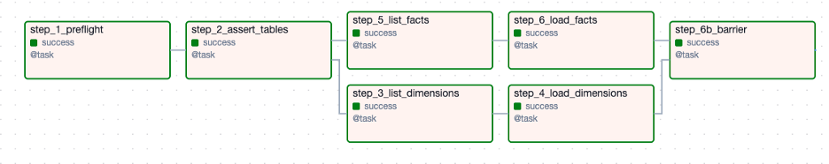
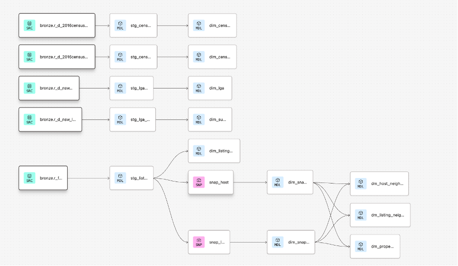

# Airbnb ELT Pipeline on GCP
### Production-Grade Data Engineering Project using Airflow, PostgreSQL, and dbt

This project builds an end-to-end cloud ELT pipeline to analyze Airbnb performance across Greater Sydney. It integrates Airbnb listings data with Australian Census demographics using a Medallion architecture and automated orchestration.

---

## 1. Project Overview
The goal of this project is to:
* **Ingest** monthly Airbnb listing data.
* **Integrate** demographic Census data.
* **Implement** Slowly Changing Dimensions (SCD Type 2).
* **Build** analytical marts for business insights.
* **Automate** the full pipeline in production.

The system runs on Google Cloud Platform and follows modern data engineering best practices.

---

## 2. System Architecture
The pipeline follows a Medallion architecture: **Bronze → Silver → Gold**.

### Components
* **Google Cloud Storage** – Raw CSV storage.
* **Airflow (Cloud Composer)** – Orchestration.
* **PostgreSQL (Cloud SQL)** – Data warehouse.
* **dbt** – Transformation and modeling.
* **Snapshots** – SCD Type 2 tracking.

### End-to-End Flow
1. Raw CSV files are uploaded to Cloud Storage.
2. **Airflow** loads raw data into the Bronze schema.
3. **dbt** transforms data into the Silver staging layer.
4. **Snapshots** capture historical attribute changes.
5. **Gold** star schema and marts are built.
6. Production runs are triggered via Airflow.

---

## 3. Airflow Orchestration
The DAG `load_to_bronze_parallel_dbt_2` manages ingestion and production builds.

### Task Breakdown
* `step_1_preflight`: Validate folders and DB connection.
* `step_2_assert_tables`: Confirm Bronze tables exist.
* `step_3_list_dimensions` → `step_4_load_dimensions`
* `step_5_list_facts` → `step_6_load_facts`
* `step_6b_barrier`: Synchronization checkpoint.
* **Trigger dbt production job**.

### Airflow DAG
<p align="center"> 
   
</p>

### Engineering Features
* **Idempotency**: Monthly ingestion is safe to retry.
* **Duplicate Prevention**: Processed files are moved via an archive strategy.
* **Schema Safety**: Explicit column `COPY` commands prevent schema drift.
* **Normalization**: Safe ISO date normalization.
* **Isolation**: Separation of Development vs. Production schemas.

---

## 4. dbt Data Warehouse Design

### Bronze Layer
* **Raw ingestion layer**: Source-aligned schema.
* **Resilience**: Dates stored as `TEXT` to prevent early parsing failures.
* **Pure Data**: No business logic applied.

### Silver Layer
Cleaned and standardized staging models including type casting, price conversion to numeric, and boolean normalization.
* **Main models**: `stg_listing`, `stg_census_g01`, `stg_census_g02`, `stg_lga_code`, `stg_lga_suburb`.

### Snapshots (SCD Type 2)
Historical tracking for `snap_listing` and `snap_host`. Each snapshot generates `dbt_valid_from` and `dbt_valid_to`, enabling time-aware joins in analytical models.

### Gold Layer
* **Star Schema Dimensions**: `dim_lga`, `dim_suburb`, `dim_census_g01`, `dim_snap_listing`, etc.
* **Analytical Marts**: `dm_listing_neighbourhood`, `dm_property_type`, `dm_host_neighbourhood`.

### dbt Lineage Graph
<p align="center"> 
   
</p>

---

## 5. Data Quality & Testing
* **dbt tests**: `not_null`, `unique`, and relationship integrity tests.
* **Source Freshness**: Monitoring data updates.
* **Target Control**: Controlled dev and prod targets for deployment safety.

---

## 6. Business Insights Generated
* **Correlation**: Revenue positively correlates with median age ($r = 0.66$).
* **Geography**: Premium coastal LGAs significantly outperform outer metro regions.
* **Hosts**: 77% of multi-listing hosts operate within a single LGA.
* **Sustainability**: 80%+ of single-listing hosts in premium LGAs generate enough revenue to cover annual mortgage repayments.

---

## 7. Key Engineering Decisions
* **Text-First Bronze**: Stored date fields as `TEXT` to avoid ingestion failures.
* **Guardrails**: Implemented `MONTH_YEAR` guards for idempotent loads.
* **Storage Management**: Archived processed files to prevent reprocessing.
* **SCD Type 2**: Used dbt snapshots for historical state tracking.

---

## 8. Tech Stack
* **Language**: Python, SQL
* **Orchestration**: Apache Airflow
* **Database**: PostgreSQL
* **Transformation**: dbt (data build tool)
* **Cloud**: Google Cloud Platform (GCS, Cloud SQL, Composer)

---

## 9. Project Structure
```text
airbnb-elt-gcp-airflow-dbt/
│
├── airflow/
│   └── load_to_bronze_parallel_dbt_2.py
│
├── dbt/
│   ├── models/
│   ├── snapshots/
│   ├── dbt_project.yml
│   └── schema.yml
│
├── sql/
│   ├── bronze_schema_setup.sql
│   └── analysis_queries.sql
│
├── architecture/
│   ├── airflow_pipeline_diagram.png
│   └── dbt_lineage.png
│
└── docs/
    └── full_project_report.pdf
```
---

## 10. Project Impact
```text
This project demonstrates a production-grade ELT architecture including cloud-native engineering, automated orchestration, star schema modeling, and SCD Type 2 implementation for real-world business analytics.
```
